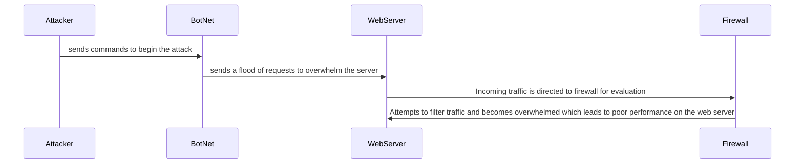

## Step by Step 
1. **Attcker Plans Attack**
   * Attacker decides to disrupt the web server's services and prepares to use the botnet to execute the _DDoS_
2. **Attacker Commands Botnet**
   * Attacker sends a command to the botnet which instructs all compromised devices to start sending malicious requests to the web server
3. **Botnet Launches Attack**
   * Each bot begins sending a high level of requests to the web server, generating a flood of traffic
4. **Traffic Reaches Firewall** 
   * The incoming requests reach the firewall that protects the web server. The firewall is configured to allow legitimate traffic while blocking the malicious data.
5. **Firewall Evaluates Traffic**
   * The firewall analyzes the incoming requests. The volume of requests overwhelms its capacity to filter and distinguish between legitamate and malicious traffic
6. **Web Server Recieves Flood of Requests and Starts to Degrade in Performance**
   * Web server recieves a high number of requests and becomes slow to respond due to the overwhelming load of information.  